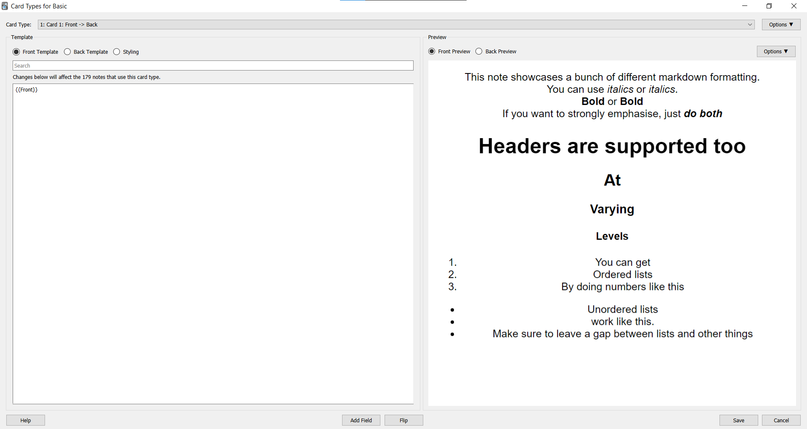
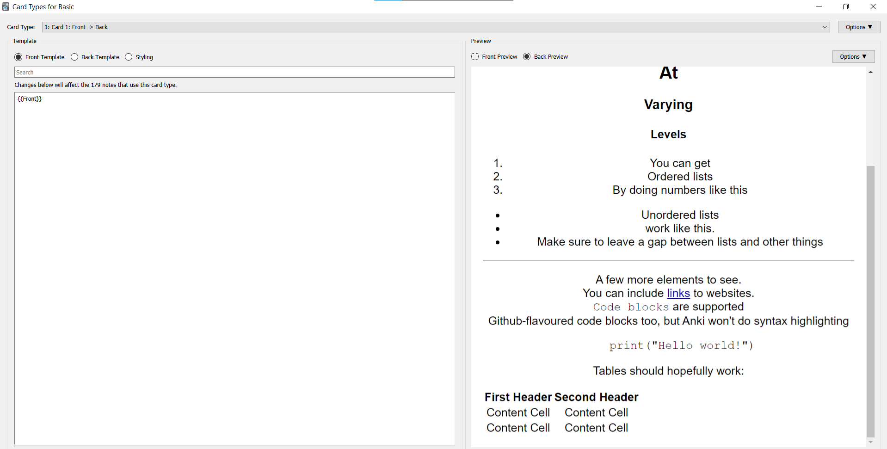

# Obsidian_to_Anki
Script to add flashcards from a properly-formatted file to Anki. Run from the command line. Built with Obsidian markdown syntax in mind.

## Setup
1. Install [Python](https://www.python.org/downloads/). Note that the script was written in Python3.8 - I don't think it would work on older versions (confirmed that it doesn't work on Python2 via [this issue](https://github.com/Pseudonium/Obsidian_to_Anki/issues/6#issue-690905446))
2. Download the desired release.
3. Place the script "obsidian_to_anki.py" in the same folder as your notes.
4. Start up [Anki](https://apps.ankiweb.net/), and navigate to your desired profile
5. Ensure that you've installed [AnkiConnect](https://github.com/FooSoft/anki-connect).
6. Install the `python-markdown` library - see installation instructions [here](https://github.com/Python-Markdown/markdown). `pip install markdown` should work.
7. Check the Permissions tab below to ensure the script is able to run.
8. From the command line, run the script once with no arguments - `obsidian_to_anki.py` (or `python obsidian_to_anki.py`)
This will make a configuration file in the same directory as the script, "obsidian_to_anki_config.ini".

See [Troubleshooting](#Troubleshooting) if you have problems.

## Permissions
The script needs to be able to:
* Make a config file in the directory the script is installed
* Read the file in the directory the script is used
* Make a backup file in the directory the script is used
* Rename files in the directory the script is used
* Remove a backup file in the directory the script is used

## Features

Current features:
* [Custom note types](#note-formatting) - You're not limited to the 6 built-in note types of Anki
* Updating notes from file - Your text files are the canonical source of the notes.
* Substitutions - see [Config](#config). Makes typing out long names easier.
* [Tags](#tag-formatting)
* Adding to user-specified [decks](#deck-formatting), on a *per-file* basis
* [Markdown](https://www.markdownguide.org/getting-started/) formatting - see [this](#markdown-formatting) for examples
* [Embedded images](#image-formatting) (GIFs should work too)
* [Auto-deleting notes](#deleting-notes) from the file
* Reading from all files in a directory automatically - not recursively however.
* [Inline Notes](#inline-note-formatting) - Shorter syntax for typing out notes on a single line
* [Custom syntax](#custom-syntax) - Using regular expressions, add custom syntax to generate notes that make sense for you.

Not available:
* Audio

## Usage
For simple documentation, run the script with the `-h` flag.

**Apart from editing the config file, all operations of the script require Anki to be running.**

To add notes to Anki from a properly-formatted file, or a directory of files, run `obsidian_to_anki.py [path]`, replacing `[path]` with the path to the file or directory.  
For example, running `obsidian_to_anki.py .` should add notes from all properly-formatted files in the current directory.  
To avoid unexpected behaviour, the script will only scan files from a directory if they have either a `.md` or `.txt` extension. If you feel like this will be a major issue, please let me know, and I can add this as something to be configured.

To edit the config file, run `obsidian_to_anki.py -c`. This will attempt to open the config file for editing, but isn't guaranteed to work. If it doesn't work, you'll have to navigate to the config file and edit it manually. For more information, see [Config](#config)

To update the config file with new note types from Anki, run `obsidian_to_anki.py -u`

To run the script in 'regex' mode (recognises user-defined syntax instead of standard script syntax), run `obsidian_to_anki.py --regex [path]`

## Config

### Syntax
As of v1.2, the Config file now allows you to change the syntax of the script:
* Begin Note - The string that signals the start of a [note](#note-formatting). Defaults to START
* End Note - The string that signals the end of a note. Defaults to END
* Begin Inline Note - The string that signals the start of an [inline note](#inline-note-formatting). Defaults to STARTI (Start-Inline)
* End Inline Note - The string that signals the end of an inline note. Defaults to ENDI (End-Inline)
* Target Deck Line - The string that signals "the line beneath me is the name of the target deck". Defaults to TARGET DECK
* File Tags Line - The string that signals "the line beneath me is the set of tags that should be added to all notes from this file". Defaults to FILE TAGS
* Delete Regex Note Line - The string that signals "the line beneath me is an id string for a regex note that should be deleted." Defaults to DELETE

### Custom syntax
As of v1.3, the section "Custom Regexps" allows you to add, for each note type, a single regexp that will add matches to Anki with that note type. For more information and some example templates, see [Regex](regex.md)

### Field substitutions
The substitutions for field prefixes. For example, under the section ['Basic'], you'll see something like this:

> Front = Front:  
> Back = Back:  

If you edit and save this to say

> Front = Front:   
> Back = A:  

Then you now format your notes like this:

> {Begin Note}  
> Basic  
> This is a test.  
> A: Test successful!  
> {End Note}  

As an inline note:

> {Begin Inline Note} [Basic] This is a test. A: Test successful! {End Inline Note}

### Note Type Substitutions
These are under the section ['Note Substitutions']. Similar to the above, you'll see something like this:
> ...  
> Basic = Basic  
> Basic (and reversed card) = Basic (and reversed card)  
> ...  

If you edit and save this to say  
> ...  
> Basic = B  
> Basic (and reversed card) = Basic (and reversed card)  
> ...  

Then you now format your notes like this:  
> {Begin Note}  
> B  
> {Note Data}  
> {End Note}

As an inline note:
> {Begin Inline Note} [B] {Note Data} {End Inline Note}

## Deck formatting
Anywhere within the file, format the deck that you want the notes to go into as follows:
> {Target Deck Line}  
> {Deck name}  

For example:
> {Target Deck Line}  
> Mathematics  

You may place more than one target deck in the same file, but only the first instance will be read and used.

## Note formatting

In the markdown file, you must format your 'block' notes as follows (see [Inline notes](#inline-note-formatting) for notes on a single line):

> {Begin Note}  
> {Note Type}  
> {Note Fields}  
> Tags:   
> {End Note}  

### Markdown formatting

Standard markdown formatting is supported.
You can check [test.md](./test.md) as an example.
Front produced:

Back produced:

### Image formatting

Embedded images are supported if the following criteria are met:
1. The image is stored locally
2. It is embedded using the standard markdown syntax: ``

### Tag formatting

For reference, the note formatting style is:

> {Begin Note}  
> {Note Type}  
> {Note Fields}  
> Tags:   
> {End Note}  

Note that the Tags: line is optional - if you don't want tags, you may leave out the line.

Tags should be formatted as such:

> Tags: Tag1 Tag2 Tag3

So, a space between the colon and the first tag, and a space between tags.

*v1.1.1 Feature*:

v1.1.1 now allows you to specify 'file tags' for a file - these tags will be added to every card in the file.

To do this:
Anywhere within the file, format the file tags as follows:
> {File Tags Line}  
> {Tag_list}  

So, for example:
> {File Tags Line}  
> Maths School Physics  

Like with tag-line formatting, you need a space between tags - however, do not include the "Tags: " prefix.

### Field formatting

Apart from the first field, each field must have a prefix to indicate to the program when to move on to the next field. For example:

> {Begin Note}  
> Basic  
> This is a test.  
> Back: Test successful!  
> {End Note}  

Note that you must start new fields on a new line for non-inline notes.  
When the script successfully adds a note, it will append an ID to the Note Data. This allows you to *update existing notes by running the script again*.

Example output:

> {Begin Note}  
> Basic  
> This is a test.  
> Back: Test successful!  
> ID: 1566052191670  
> {End Note}  

### Deleting notes

The script can delete notes that *it has added* automatically. To do this:
1. Find the formatted note in your file:
> {Begin Note}  
> {Note Type}  
> {Note Data}  
> ID: {Identifier}  
> {End Note}  
2. Change this to read:
> {Begin Note}  
> ID: {Identifier}  
> {End Note}  
3. If you run the script on the file, it will interpret this as "delete the note with ID {identifier}". For convenience, it will also delete the unnecessary {Begin Note} {End Note} block from the file.

See [Deleting inline notes](#deleting-inline-notes) for how to do this with inline notes.

## Inline note formatting
*v1.2 feature*
v1.2 of the script introduces **inline notes** - notes which are entirely on a single line. They are formatted as such:  

> {Begin Inline Note} [{Note Type}] {Note Data} {End Inline Note}  

For example  

> {Begin Inline Note} [Basic] This is a test. Back: Test successful! {End Inline Note}  

Unlike regular 'block' notes, you can put inline notes anywhere on a line - for example, you could have a bulletpointed list of inline notes.  
Also, unlike regular 'block' notes, the script identifies the note type through the string in square brackets. Hence, **note types with [ or ] in the name are not supported for inline notes**.

### Deleting inline notes

The instructions are quite similar to deleting normal notes:
1. Find the formatted note in your file:
> {Begin Inline Note} [{Note Type}] {Note Data} ID: {Identifier} {End Inline Note}
2. Change this to read:
> {Begin Inline Note} ID: {Identifier} {End Inline Note}
3. If you run the script on the file, it will interpret this as "delete the note with ID {identifier}". For convenience, it will also delete the unnecessary {Begin Inline Note} {End Inline Note} block from the file.

## Default
By default, the script:
- Adds notes with the tag "Obsidian_to_Anki" (+ other specified tags, if applicable)
- Adds to the Default deck (if TARGET DECK is not specified)
- Adds to the current profile in Anki  

## Troubleshooting

If the script itself is not able to run, try running `python3 {PATH_TO_SCRIPT}`.

You may also want to prepend the following shebang to the start of the file:

`#!/usr/bin/env python`

For more information, see [this pull request](https://github.com/Pseudonium/Obsidian_to_Anki/pull/13)

If you are getting a `KeyError`, you may have typed one of the [substitutions](#Config) wrong - double check the config file and what you actually wrote.
Examples:
* Anki actually stores "Basic (and reversed)" as "Basic (and reversed card)" - hence, without changing the config file, formatting "Basic (and reversed)" for the note type will throw a `KeyError`

The script seems to have unexpected behaviour when reading from a file for the first time, while the file is open in another program (though this doesn't always happen!). So, be wary of doing this. Removing the ID: None line and running the script again seems to fix it.

## Technical
The script doesn't need to be in the same folder as your notes - you can put it in a Scripts folder if you have the means to run it remotely. Just ensure that the config file ends up in the same folder as the script.
