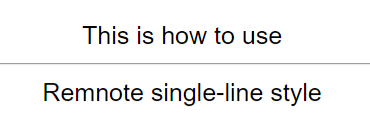
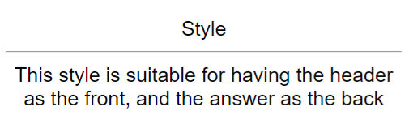
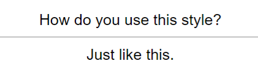
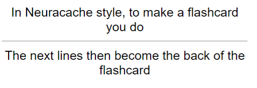
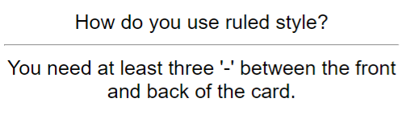
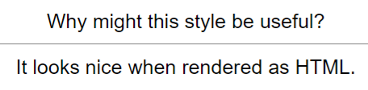
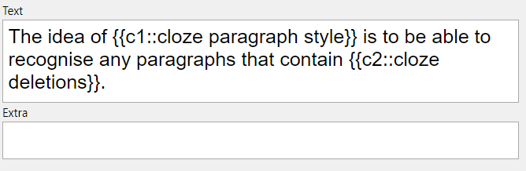
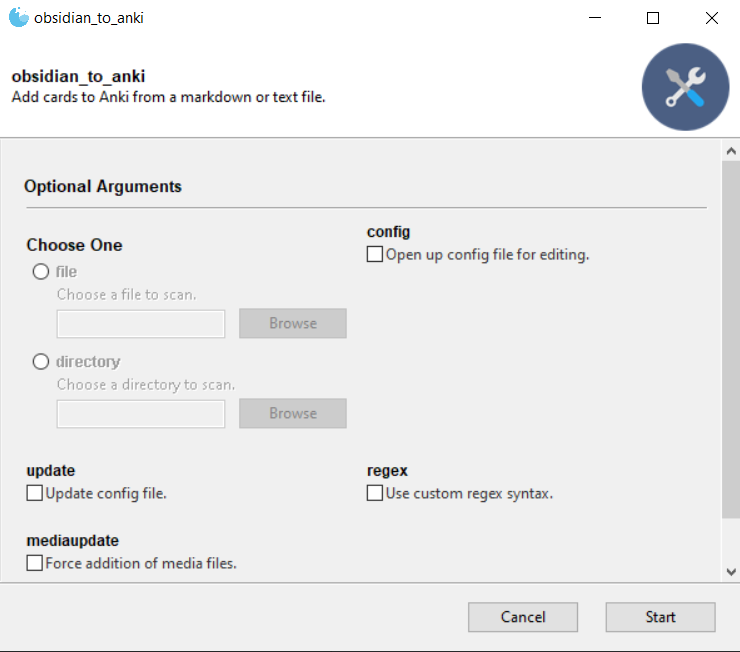

# Obsidian_to_Anki
Script to add flashcards from a text or markdown file to Anki. Run from the command line. Built with [Obsidian](https://obsidian.md/) markdown syntax in mind. Supports **user-defined custom syntax for flashcards.**  
See the [Trello](https://trello.com/b/6MXEizGg/obsidiantoanki) for planned features.

## Features

Current features:
* **[Custom note types](#note-formatting)** - You're not limited to the 6 built-in note types of Anki.
* **Updating notes from file** - Your text files are the canonical source of the notes.
* **[Tags](#tag-formatting)**, including **[tags for an entire file](#file-tag-formatting)**.
* **Adding to user-specified [decks](#deck-formatting),** on a *per-file* basis.
* **[Markdown formatting](#markdown-formatting)**, including **[math formatting](#math-formatting)**
* **[Embedded images](#image-formatting)**. GIFs should work too.
* **[Audio](#audio-formatting)**.
* **[Auto-deleting notes](#deleting-notes) from the file**.
* **Reading from all files in a directory automatically** - recursively too!
* **[Inline Notes](#inline-note-formatting)** - Shorter syntax for typing out notes on a single line.
* **[Easy cloze formatting](#cloze-formatting)** - A more compact syntax to do Cloze text
* **[Obsidian integration](#obsidian)** - Currently, this only includes a link to the file that made the flashcard, appended to the first field of your card.
* **[Custom syntax](regex.md)** - Using **regular expressions**, add custom syntax to generate **notes that make sense for you.** Some examples:
  * [RemNote single-line style](regex.md#remnote-single-line-style). `This is how to use::Remnote single-line style`  
  
  * [Header paragraph style](regex.md#header-paragraph-style).
  <pre>
  # Style
  This style is suitable for having the header as the front, and the answer as the back
  </pre>  
  
  * [Question answer style](regex.md#question-answer-style).
  <pre>
  Q: How do you use this style?
  A: Just like this.
  </pre>  
  
  * [Neuracache #flashcard style](regex.md#neuracache-flashcard-style).  
  <pre>
  In Neuracache style, to make a flashcard you do #flashcard
  The next lines then become the back of the flashcard
  </pre>  
  
  * [Ruled style](regex.md#ruled-style)  
  <pre>
  How do you use ruled style?
  ---
  You need at least three '-' between the front and back of the card.
  </pre>  
  
  * [Markdown table style](regex.md#markdown-table-style)  
  <pre>
  | Why might this style be useful? |
  | ------ |
  | It looks nice when rendered as HTML in a markdown editor. |
  </pre>
  
  * [Cloze paragraph style](regex.md#cloze-paragraph-style)  
  <pre>
  The idea of {cloze paragraph style} is to be able to recognise any paragraphs that contain {cloze deletions}.
  </pre>
  

Note that **all custom syntax is off by default**, and must be programmed into the script via the config file - see [Custom syntax](regex.md) for instructions.

## Who is this for?

It might be useful to show the motivation for me personally writing the script in the first place.  
My workflow is essentially to have notes *be* flashcards - [one of my notes](https://www.evernote.com/shard/s522/sh/672b696d-4944-4894-a641-c84529d9ce9b/230b93561681475726fa1e2188becf78) (before I discovered Obsidian). However, it got tedious to keep copy-pasting cards into Anki, so I got the idea to write a script to do it automatically.

However, you don't need to have your notes be files of flashcards to use this script! You just need to be fine with visibly embedding flashcards in your notes, and keeping them there for future reference/editing. The script will ignore anything it doesn't think is a flashcard, so you're free to add context/information not needed for Anki to your notes.

## Setup
1. Install the latest version of [Python](https://www.python.org/downloads/).
2. Start up [Anki](https://apps.ankiweb.net/), and navigate to your desired profile.
3. Ensure that you've installed [AnkiConnect](https://github.com/FooSoft/anki-connect).
4. If you are a new user, download `obstoanki_setup.py` from the [releases page](https://github.com/Pseudonium/Obsidian_to_Anki/releases), and place it in the folder you want the script installed (for example your notes folder).  
5. Run `obstoanki_setup.py`, for example by double-clicking it in a file explorer. This will download the latest version of the script and required dependencies automatically. Existing users should be able to run their existing `obstoanki_setup.py` to get the latest version of the script.  
6. Check the Permissions tab below to ensure the script is able to run.
7. Run `obsidian_to_anki.py`, for example by double-clicking it in a file explorer. This will generate a config file, `obsidian_to_anki_config.ini`.

See [Troubleshooting](#Troubleshooting) if you have problems.

## Permissions
The script needs to be able to:
* Make a config file in the directory the script is installed.
* Read the file in the directory the script is used.
* Make a backup file in the directory the script is used.
* Rename files in the directory the script is used.
* Remove a backup file in the directory the script is used.
* Change the current working directory temporarily (so that local image paths are resolved correctly).

## Usage

**Apart from editing the config file, all operations of the script require Anki to be running.**  
New in v2.7.0 - if you supply Anki Path and Anki Profile, the script will automatically attempt to open Anki if it isn't already running.  

The GUI of the script looks like this:  

Hopefully the options and path are self-explanatory. The 'recurse' option can be used on the top-level notes directory - it'll pick up all the notes in subfolders automatically.
Note that you can run the script over the same file twice perfectly fine - it won't add duplicate cards. 

### Command line usage
If you set 'GUI' in the config file to False, the script is then run from the command line:
* Use `-h` to see help.
* Run the script as `obsidian_to_anki.py [path]`, where `[path]` is the path to the file or folder you wish to add notes from.
* Use `-c` to open up the config file for editing (not guaranteed to work on all operating systems, if it doesn't you'll have to find and edit it manually).
* Use `-u` to update the config file. Do this when you add new note types to Anki.
* Use `-m` to force the script to add all media files detected, instead of lazy addition of media files. Useful if you've e.g. resized the image, and want the changes to be reflected in Anki.
* Use `-r` to use custom regex syntax, ignoring the default syntax of the script.
* Use `-R` to recursively scan subfolders.

## New users

If you are a **new user**, these steps are recommended:
1. Check [Custom syntax](regex.md) to see if there is a template that works for you.
2. Then, check the information on the following topics:
 * **Adding to user-specified [decks](#deck-formatting),** on a *per-file* basis.
 * **[Markdown formatting](#markdown-formatting)**, including **[math formatting](#math-formatting)**
 * **[Embedded images](#image-formatting)**. GIFs should work too.
 * **[Auto-deleting notes](#deleting-notes) from the file**.
 * **[File tag formatting](#file-tag-formatting)**.
 * **[Easy cloze formatting](#cloze-formatting)** - A more compact syntax to do Cloze text
 * [Defaults](#default).
3. You should be good to go simply running the script with the 'Regex' option checked.

The sections below describe the default syntax of the script (with the 'Regex' option not checked).

## Config

### DEFAULT section
Allows you to change the default deck and tag of the script.  
New in v2.2.2 - allows you to enable/disable the 'CurlyCloze' option, which is explained in [Cloze formatting](#cloze-formatting)  .
New in v2.4.0 - allows you to enable/disable the GUI of the script - see [Command line usage](#command-line-usage).  
New in v2.5.0 - allows you to enable/disable IDs being embedded in HTML comments. The script can read IDs whether or not they are in a HTML comment.  
New in v2.5.0 - allows you to have regex mode on by default.  
New in v2.7.0 - Anki Path and Anki Profile. If you supply both the absolute path to the Anki executable, and your profile on Anki, the script will attempt to open Anki when run if it's not already running. Useful for automation - see [Technical](#technical)

### Cloze note types
New in v2.8.0 - allows you to indicate whether or not a note type should be interpreted as a 'Cloze' type. You must set this to 'True' if you wish to use the 'CurlyCloze' option with this note type - see [Cloze formatting](#cloze-formatting).

### Obsidian
This section is new in v2.9.0.  
Vault name: The name of your obsidian vault that you're adding flashcards from.  
Add file link: Whether you want to append a link to the associated obsidian file on the first field of the card.  

### Syntax
Note that START, END, TARGET DECK, FILE TAGS and DELETE all require an **exact match** on the line - you cannot have spaces afterwards.
As of v1.2, the Config file now allows you to change the syntax of the script:
* Begin Note - The string that signals the start of a [note](#note-formatting). Defaults to START.
* End Note - The string that signals the end of a note. Defaults to END.
* Begin Inline Note - The string that signals the start of an [inline note](#inline-note-formatting). Defaults to STARTI (Start-Inline).
* End Inline Note - The string that signals the end of an inline note. Defaults to ENDI (End-Inline).
* Target Deck Line - The string that signals "the line beneath me is the name of the target deck". Defaults to TARGET DECK.
* File Tags Line - The string that signals "the line beneath me is the set of tags that should be added to all notes from this file". Defaults to FILE TAGS.
* Delete Regex Note Line - The string that signals "the line beneath me is an id string for a regex note that should be deleted." Defaults to DELETE.

### Added Media
This section is reserved for the script to keep track of what media files it has added. You can clear this by running the script with the `-m` flag.

## Deck formatting
Anywhere within the file, format the deck that you want the notes to go into as follows:
<pre>
{Target Deck Line}
{Deck name}
</pre>
For example, with the default settings:
<pre>
TARGET DECK
Mathematics
</pre>
You may place more than one target deck in the same file, but only the first instance will be read and used.

## Note formatting

In the markdown file, you must format your 'block' notes as follows (see [Inline notes](#inline-note-formatting) for notes on a single line):
<pre>
START
{Note Type}
{Note Fields}
Tags:
END
</pre>

### Markdown formatting

Standard markdown formatting is supported.
You can check [test.md](./test.md) as an example.
Card produced:

### Math formatting
Supports both inline mode and displayed mode:
<pre>
Inline $x = 5$
</pre>
<pre>
Displayed $$z = 10$$
</pre>

### Image formatting

Embedded images are supported if they are embedded using the standard markdown syntax: ``

v2.3 - Web-hosted images are now supported! Do ``. You'll want to do 'copy image address' on the image, and use that for the image url.

### Audio formatting

Embedded audio is supported if the following criteria are met:
1. The audio file is stored locally
2. It is embedded using the syntax `[sound:{path_to_file}]`. So, for example, if the filename was `record.wav` and it was in a `Media` folder, you'd write `[sound:Media/record.wav]`

### Tag formatting

For reference, the note formatting style is:

<pre>
START
{Note Type}
{Note Fields}
Tags:
END
</pre>
Note that the Tags: line is optional - if you don't want tags, you may leave out the line.

Tags should be formatted as such:
<pre>
Tags: Tag1 Tag2 Tag3
</pre>
So, **a space between the colon and the first tag**, and a space between tags.

Hence, this syntax **would not work**:
<pre>
Tags:Tag1 Tag2 Tag3
</pre>

### File tag formatting

v1.1.1 now allows you to specify 'file tags' for a file - these tags will be added to every card in the file.

To do this:
Anywhere within the file, format the file tags as follows:
<pre>
{File Tags Line}
{Tag list}
</pre>
For example, with the default settings:
<pre>
FILE TAGS
Maths School Physics
</pre>
Like with tag-line formatting, you need a space between tags - however, do not include the "Tags: " prefix.

### Field formatting

Apart from the first field, each field must have a prefix to indicate to the program when to move on to the next field. For example:

<pre>
START
Basic
This is a test.
Back: Test successful!
END
</pre>

Note that you must start new fields on a new line for non-inline notes.  
When the script successfully adds a note, it will append an ID to the Note Data. This allows you to *update existing notes by running the script again*.

Example output:
<pre>
START
Basic
This is a test.
Back: Test successful!
&lt;!--ID: 1566052191670--&gt;
END
</pre>

### Deleting notes

The script can delete notes that *it has added* automatically. To do this:
1. Find the formatted note in your file:
<pre>
START
{Note Type}
{Note Data}
&lt;!--ID: {Identifier}--&gt;
END
</pre>
2. Change this to read:
<pre>
START
&lt;!--ID: {Identifier}--&gt;
END
</pre>
3. If you run the script on the file, it will interpret this as "delete the note with ID {identifier}". For convenience, it will also delete the unnecessary `START END` block from the file.

Note that if you manually delete a note in Anki, **you must remove the ID line from the text file**. Otherwise, the script will throw an error.

See [Deleting inline notes](#deleting-inline-notes) for how to do this with inline notes.

## Inline note formatting

*v1.2 feature*
v1.2 of the script introduces **inline notes** - notes which are entirely on a single line. They are formatted as such:  
<pre>
STARTI [{Note Type}] {Note Data} ENDI
</pre>
For example  
<pre>
STARTI [Basic] This is a test. Back: Test successful! ENDI  
</pre>
Unlike regular 'block' notes, you can put inline notes anywhere on a line - for example, you could have a bulletpointed list of inline notes.  
Also, unlike regular 'block' notes, the script identifies the note type through the string in square brackets. Hence, **note types with [ or ] in the name are not supported for inline notes.**

### Deleting inline notes

The instructions are quite similar to deleting normal notes:
1. Find the formatted note in your file:
<pre>
STARTI [{Note Type}] {Note Data} &lt;!--ID: {Identifier}--&gt; ENDI
</pre>
2. Change this to read:
<pre>
STARTI &lt;!--ID: {Identifier}--&gt; ENDI
</pre>
3. If you run the script on the file, it will interpret this as "delete the note with ID {identifier}". For convenience, it will also delete the unnecessary `STARTI ENDI` block from the file.

Note that if you manually delete a note in Anki, **you must remove the ID line from the text file**. Otherwise, the script will throw an error.

### Cloze formatting

New in v2.8.0  
In any note, you can do clozes using Anki's standard syntax:  
`This is a {{c1::cloze note}}`  
However, by enabling the 'CurlyCloze' option (see [Config](#config)), you have access to many easier options:

1. `This is a {cloze} note with {two clozes}`
->
`This is a {{c1::cloze}} note with {{c2::two clozes}}`
2. `This is a {2:cloze} note with {1:id syntax}`
->
`This is a {{c2::cloze}} note with {{c1::id syntax}}`
3. `This is a {2|cloze} {3|note} with {1|alternate id syntax}`
->
`This is a {{c2::cloze}} {{c3::note}} with {{c1::alternate id syntax}}`
4. `This is a {c1:cloze} note with {c2:another} type of {c3:id syntax}`
->
`This is a {{c1::cloze}} note with {{c2::another}} type of {{c3::id syntax}}`
5. `This is a {c1|cloze} note with {c2|yet another} type of {c3|id syntax}`
->
`This is a {{c1::cloze}} note with {{c2::yet another}} type of {{c3::id syntax}}`

You can also mix and match styles! Note that clozes without an id will always be assigned an id starting from 1, increasing for each new cloze:
`This is a {cloze} note with {multiple} non-id clozes, as well as {2:some clozes} with {c1|other styles}`
->
`This is a {{c1::cloze}} note with {{c2::multiple}} non-id clozes, as well as {{c2::some clozes}} with {{c1::other styles}}`

## Default
By default, the script:
- Adds notes with the DEFAULT Tag in the config file (+ other specified tags, if applicable).  
- Adds to the DEFAULT Deck in the config file (if `{Target Deck Line}` is not specified).  
- Adds to the current profile in Anki.  

## Troubleshooting

If the script itself is not able to run, try running `python3 {PATH_TO_SCRIPT}`.

If you are unable to get `pip` to run, see this [user guide](https://pip.pypa.io/en/stable/user_guide/).

Some people have reported issues with installing the `Gooey` dependency. From v2.5.0 onwards, the script can run without `Gooey`, falling back to a command-line interface.

If you are getting a `KeyError`, you may have typed one of the [substitutions](#Config) wrong - double check the config file and what you actually wrote.
Examples:
* Anki actually stores "Basic (and reversed)" as "Basic (and reversed card)" - hence, without changing the config file, formatting "Basic (and reversed)" for the note type will throw a `KeyError`

The script seems to have unexpected behaviour when reading from a file for the first time, while the file is open in another program (though this doesn't always happen!).  
The script was written in Python 3.8.5, and it uses `os` module features from Python 3.6+ [This issue](https://github.com/Pseudonium/Obsidian_to_Anki/issues/6#issue-690905446) confirms that the script does not run on Python 2.

## Technical
The script doesn't need to be in the same folder as your notes - you can put it in a Scripts folder if you have the means to run it remotely. Just ensure that the config file ends up in the same folder as the script.

You may also want to prepend the following shebang to the start of the file:

`#!/usr/bin/env python`

For more information, see [this pull request](https://github.com/Pseudonium/Obsidian_to_Anki/pull/13).

New in v2.7.0 - the script can now automatically open Anki if Anki Path and Anki Profile are supplied. This would allow you to schedule the script to run at a certain time without needing to worry about whether Anki was open at that time.

Note that the script will never close Anki by itself, so you may find Anki open when you return to your computer!

For those having issues installing on Ubuntu, check out [#99](https://github.com/Pseudonium/Obsidian_to_Anki/issues/99).

### Scheduling

On Windows, check out [Task Scheduler](https://www.windowscentral.com/how-create-automated-task-using-task-scheduler-windows-10).

On macOS/Linux, check out Corey Schafer's excellent tutorial on [cron](https://www.youtube.com/watch?v=QZJ1drMQz1A).

As an example, you could schedule the script to run recursively over your top-level notes folder, at midnight every day.
