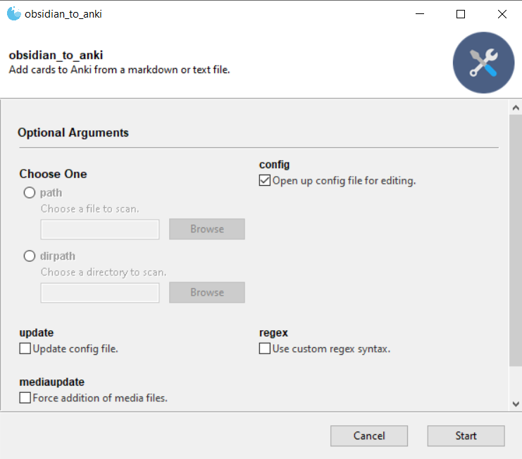
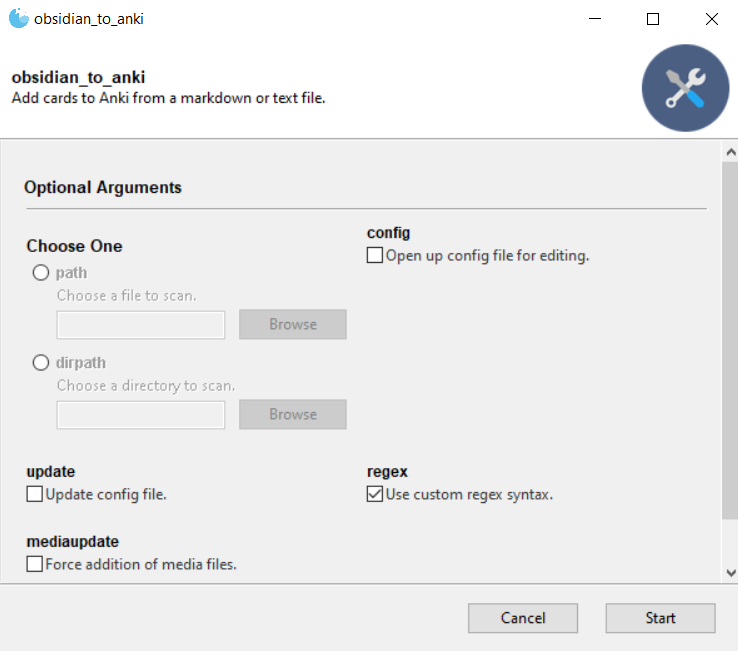
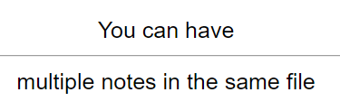
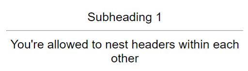
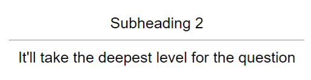
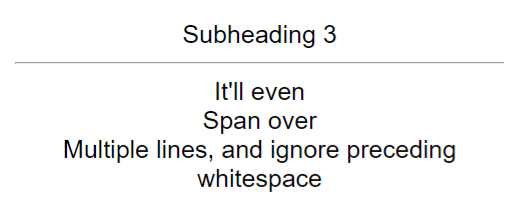
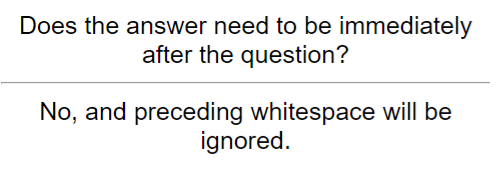
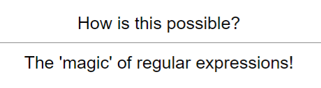
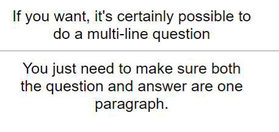
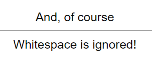

# Table of contents
This page lists templates for custom syntax. In each case, copy-paste the regex line into the desired note type in the config file to use the template.

* [RemNote single-line style](#remnote-single-line-style)
* [Header paragraph style](#header-paragraph-style)
* [Question answer style](#question-answer-style)
* [Neuracache #flashcard style](#neuracache-flashcard-style)
* [Ruled style](#ruled-style)  

- [Custom styles?](#custom-styles)
- [Tagging notes](#tagging-notes)
- [Deleting notes](#deleting-notes)

## RemNote single-line style

**Regex line:** `^(.*[^\n:]{1}):{2}([^\n:]{1}.*)`

**Example usage:**
1. Create a file called `test.md`
2. Paste the following contents into the file:
<pre>
This is how to use::Remnote single-line style
The script won't see things outside of it.
You can have::multiple notes in the same file
</pre>
3. Run the script, and check 'Config' to open up the config file:  

4. Navigate to the "Custom Regexps" section
5. Change the line
<pre>
Basic =  
</pre>
to  
<pre>
Basic = ^(.*[^\n:]{1}):{2}([^\n:]{1}.*)
</pre>
6. Save the config file
7. Run the script on the file, with 'Regex' checked:  

8. You should see these cards in Anki:  
  

## Header paragraph style

**Regex line:** `^#+(.+)\n+((?:[^\n#][\n]?)+)`

**Example usage:**
1. Create a file called `test.md`
2. Paste the following contents into the file:
<pre>
# Style  
This style is suitable for having the header as the front, and the answer as the back
# Overall heading
## Subheading 1
You're allowed to nest headers within each other
## Subheading 2
It'll take the deepest level for the question
## Subheading 3
   
   
   
It'll even
Span over
Multiple lines, and ignore preceding whitespace
</pre>
3. Run the script, and check 'Config' to open up the config file:  

4. Navigate to the "Custom Regexps" section
5. Change the line
<pre>
Basic =
</pre>
to  
<pre>
Basic = ^#+(.+)\n+((?:[^\n#][\n]?)+)
</pre>
6. Save the config file
7. Run the script on the file, with 'Regex' checked:  

8. You should see these cards in Anki:  
  
  
  
  

### Subheader paragraph style

If you'd like the effect of the header paragraph style, but only want it to add cards below a certain subheading level (e.g. 3 # or more), use the following regex:

* 2 or more - `^#{2,}(.+)\n+((?:[^\n#][\n]?)+)`
* 3 or more - `^#{3,}(.+)\n+((?:[^\n#][\n]?)+)`
* n or more - `^#{n,}(.+)\n+((?:[^\n#][\n]?)+)`, where you replace `{n,}` with the value of the number n. E.g. if n was 4, it would read `^#{4,}(.+)\n+((?:[^\n#][\n]?)+)`

## Question answer style

**Regex line:** `^Q: ((?:[^\n][\n]?)+)\n+A: ((?:[^\n][\n]?)+)`

**Example usage:**
1. Create a file called `test.md`
2. Paste the following contents into the file:
<pre>
Q: How do you use this style?
A: Just like this.

Q: Can the question
run over multiple lines?
A: Yes, and
So can the answer

Q: Does the answer need to be immediately after the question?

A: No, and preceding whitespace will be ignored.

Q: How is this possible?
A: The 'magic' of regular expressions!
</pre>
3. Run the script, and check 'Config' to open up the config file:  

4. Navigate to the "Custom Regexps" section
5. Change the line
<pre>
Basic =
</pre>
to  
<pre>
Basic = ^Q: ((?:[^\n][\n]?)+)\n+A: ((?:[^\n][\n]?)+)
</pre>
6. Save the config file
7. Run the script on the file, with 'Regex' checked:  

8. You should see these cards in Anki:  
  
  
  
  

## Neuracache #flashcard style

**Regex line:** `((?:[^\n][\n]?)+) #flashcard\n+((?:[^\n][\n]?)+)`

**Example usage:**
1. Create a file called `test.md`
2. Paste the following contents into the file:
<pre>
In Neuracache style, to make a flashcard you do #flashcard
The next lines then become the back of the flashcard

If you want, it's certainly possible to
do a multi-line question #flashcard
You just need to make sure both
the question and answer are one paragraph.

And, of course #flashcard

Whitespace is ignored!

</pre>
3. Run the script, and check 'Config' to open up the config file:  

4. Navigate to the "Custom Regexps" section
5. Change the line
<pre>
Basic =
</pre>
to  
<pre>
Basic = ((?:[^\n][\n]?)+) #flashcard\n+((?:[^\n][\n]?)+)
</pre>
6. Save the config file
7. Run the script on the file, with 'Regex' checked:  

8. You should see these cards in Anki:  
  
  
  

## Ruled style

**Regex line:** `((?:[^\n][\n]?)+\n)-{3,}\n((?:[^\n][\n]?)+)`

**Example usage:**
1. Create a file called `test.md`
2. Paste the following contents into the file:
<pre>
How do you use ruled style?
---
You need at least three '-' between the front and back of the card.

Are paragraphs
supported?
---------
Yes, but you need the front and back
directly before and after the ruler.
</pre>
3. Run the script, and check 'Config' to open up the config file:  

4. Navigate to the "Custom Regexps" section
5. Change the line
<pre>
Basic =  
</pre>
to  
<pre>
Basic = ((?:[^\n][\n]?)+\n)-{3,}\n((?:[^\n][\n]?)+)
</pre>
6. Save the config file
7. Run the script on the file, with 'Regex' checked:  

8. You should see these cards in Anki:  
  

## Custom styles
The above styles are but a few examples of the endless possible styles you can make using regular expressions.
If you want to make your own style, however, you should know these things:
* The script automatically compiles the regular expression with a 'multiline' flag, so you can use the `^` character to signal the beginning of a line
* You need to have as many capture groups in your regexp as there are fields in the note type - the 1st capture group becomes the 1st field, the 2nd becomes the 2nd field etc

If you'd like for your style to be added to this page, make a style-request issue and I'll consider it. 

## Tagging notes
Cards made using this format support tags - simply append a "Tags: {tag_list}" to the end of your block. Note that this should be on the same line as the block, not on a new line (as that is reserved for the ID)

## Deleting notes
To delete notes made using this format, remove the content before the ID and make it look like:
<pre>
{Delete Regex Note Line}  
ID: 129840142123  
</pre>
With the default settings:
<pre>
DELETE  
ID: 129414201900  
</pre>
## Conflicts?
Try to make sure your regex matches don't overlap with each other. The script is designed, however, to not recognise a match inside another match (for different note types).

For example, if you're using the default syntax of the script for the 'Cloze' note type:
<pre>
START
Cloze
This is a {{c1::test}}
END
</pre>

, you don't have to worry about a RemNote single-line match being picked up.
