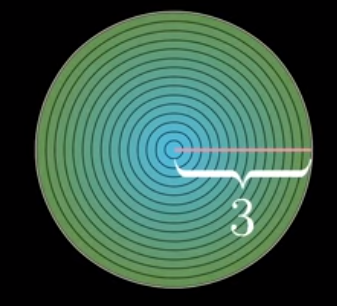
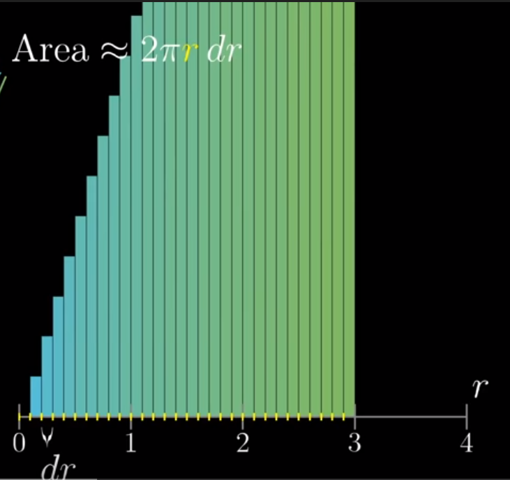
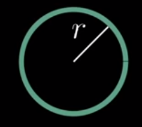

This is to test images.

TARGET DECK
Test

START
Basic
This is for test0
Back: 
END

START
Basic
This is for test1
Back: 
END

START
Basic
This is for test2
Back: 
END

START
Basic
This is for test3
Back: 
END

START
Basic
This is for test4
Back: 
END

START
Basic
This is for testing duplicates
Back: 
END
